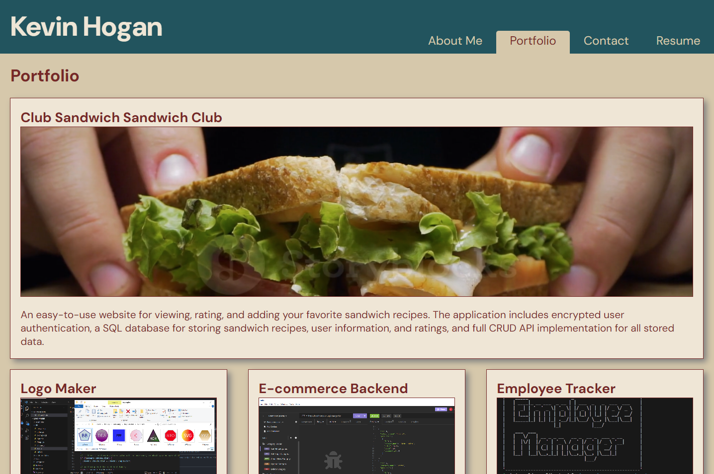

# React Portfolio Website

## Description
A portfolio page built using React to demonstrate my work creating websites, databases, APIs, and node.js applications.

## Table of Contents

- [Installation](#installation)
- [Usage](#usage)
- [Credits](#credits)
- [License](#license)
- [Questions](#questions)

## Installation

[Deployed Website](https://kevinhogansprofile.netlify.app/)

## Usage

* Click on 'About' to see a recent photo of the developer and a short bio about them
* Click on 'Portfolio' see titled images of the developer’s applications
    * Click on a Project Card to be taken to a detailed description of the project with links to the deployed applications, the corresponding GitHub repository, and demonstration videos when available
* Click on 'Contact' to see a contact form with fields for a name, an email address, and a message
* Click on Resume to see a link to a downloadable resume and a list of the developer’s proficiencies

## Credits

* Node.js & Eslint Copyright [OpenJS Foundation](https://openjsf.org/) and Node.js contributors. All rights reserved. 
* React, React-dom, Eslint-plugin-react-hooks Copyright © Meta Platforms, Inc. and affiliates.
* React-router-dom Copyright © React Training LLC 2015-2019 Copyright © Remix Software Inc. 2020-2021 Copyright © Shopify Inc. 2022-2023
* Eslint-plugin-react Copyright © 2014 Yannick Croissant
* Eslint-plugin-react-refresh Copyright © Arnaud Barré (https://github.com/ArnaudBarre)
* Vite Copyright © 2019-present, Yuxi (Evan) You and Vite contributors

## License

This application is covered under the MIT License.

## Questions

[GitHub Profile](https://github.com/kevinchogan)

For questions, please contact kchogan@pacbell.net.
